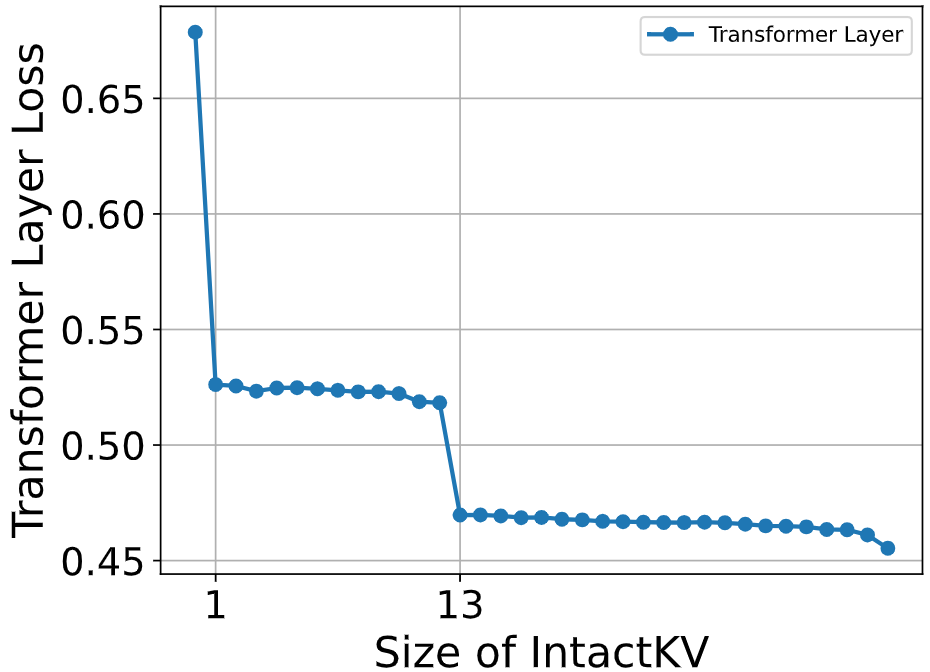

# IntactKV: Improving Large Language Model Quantization by Keeping Pivot Tokens Intact

This repository contains the PyTorch implementation of [IntactKV: Improving Large Language Model Quantization by Keeping Pivot Tokens Intact](https://arxiv.org/abs/2403.01241).


IntactKV is a simple and orthogonal method to enhance the quantized LLMs.  It can be feasibly combined with various existing quantization approaches (e.g., AWQ, OmniQuant, GPTQ, QuaRot) with no inference overhead on various LLMs (LLaMA, Vicuna, OPT, Mistral e.t.c.).  IntactKV is built on a valuable observation that pivot tokens do exist in current LLMs with massive values and highly concentrated attention scores, and thay are critical to the performance of quantized LLMs. A concurrent work [Massive Activations](https://arxiv.org/abs/2402.17762) also discovers such tokens and provides more detailed studies on this phenomenon.


# Preparations
## Installation

```bash
conda create -n intactkv python=3.10 -y
conda activate intactkv
pip install -r requirements.txt
```


## Data Preparation
Download datasets in `./datasets`.

**Calibration set or PPL evaluation**

| Dataset  | Local Dir  |  URL |
| ------------ | ------------ | ------------ |
| WikiText2  | ./datasets/wikitext  | [https://huggingface.co/datasets/wikitext](https://huggingface.co/datasets/wikitext)  |
| PTB  | ./datasets/ptb_text_only  | [https://huggingface.co/datasets/ptb_text_only](https://huggingface.co/datasets/ptb_text_only)  |
| C4  | ./datasets/allenai/c4  | [https://huggingface.co/datasets/allenai/c4](https://huggingface.co/datasets/allenai/c4)  |
| Pile  | ./datasets/pile-val-backup  |  [https://huggingface.co/datasets/mit-han-lab/pile-val-backup](https://huggingface.co/datasets/mit-han-lab/pile-val-backup) |
| ShareGPT  | ./datasets/ShareGPT_Vicuna_unfiltered  |  [https://huggingface.co/datasets/Aeala/ShareGPT_Vicuna_unfiltered](https://huggingface.co/datasets/Aeala/ShareGPT_Vicuna_unfiltered) |

**MMLU evaluation**

| Dataset  | Local Dir  |  URL |
| ------------ | ------------ | ------------ |
| MMLU  | ./datasets/mmlu/data  | [https://people.eecs.berkeley.edu/~hendrycks/data.tar](https://people.eecs.berkeley.edu/~hendrycks/data.tar)  |

**Commonsense QA evaluation**

| Dataset  | Local Dir  |  URL |
| ------------ | ------------ | ------------ |
|  OBQA | ./datasets/openbookqa  | [https://huggingface.co/datasets/openbookqa](https://huggingface.co/datasets/openbookqa)  |
|  WinoGrande |  ./datasets/winogrande | [https://huggingface.co/datasets/winogrande](https://huggingface.co/datasets/winogrande)  |
|  ARC-E and ARC-C  | ./datasets/ai2_arc  | [https://huggingface.co/datasets/ai2_arc](https://huggingface.co/datasets/ai2_arc)  |
|  BoolQ | ./datasets/super_glue  | [https://huggingface.co/datasets/super_glue](https://huggingface.co/datasets/super_glue)  |
|  HellaSwag | ./datasets/hellaswag  |  [https://huggingface.co/datasets/hellaswag](https://huggingface.co/datasets/hellaswag) |
|  LAMBADA | ./datasets/lambada_openai  | [https://huggingface.co/datasets/EleutherAI/lambada_openai](https://huggingface.co/datasets/EleutherAI/lambada_openai)  |


## Model Preparation

Download models in `./modelzoo`.

| Model  | Local Dir  |  URL |
| ------------ | ------------ | ------------ |
|  LLaMA-2-7B  |  ./modelzoo/llama-2/llama-2-7b  |  [https://huggingface.co/meta-llama/Llama-2-7b](https://huggingface.co/meta-llama/Llama-2-7b)  |
|  LLaMA-2-13B  |  ./modelzoo/llama-2/llama-2-13b  |  [https://huggingface.co/meta-llama/Llama-2-13b](https://huggingface.co/meta-llama/Llama-2-13b)  |
|  LLaMA-2-70B  |  ./modelzoo/llama-2/llama-2-70b  |  [https://huggingface.co/meta-llama/Llama-2-70b](https://huggingface.co/meta-llama/Llama-2-70b)  |
|  LLaMA-3-8B  |  ./modelzoo/llama-3/llama-3-8b  |  [https://huggingface.co/meta-llama/Meta-Llama-3-8B](https://huggingface.co/meta-llama/Meta-Llama-3-8B)  |
|  LLaMA-3-70B  |  ./modelzoo/llama-3/llama-3-70b  |  [https://huggingface.co/meta-llama/Meta-Llama-3-70B](https://huggingface.co/meta-llama/Meta-Llama-3-70B)  |
|  Vicuna-v1.3-7B  |  ./modelzoo/vicuna-v1.3/vicuna-v1.3-7b   |  [https://huggingface.co/lmsys/vicuna-7b-v1.3](https://huggingface.co/lmsys/vicuna-7b-v1.3)  |
|  Vicuna-v1.3-13B  |  ./modelzoo/vicuna-v1.3/vicuna-v1.3-13b   |  [https://huggingface.co/lmsys/vicuna-13b-v1.3](https://huggingface.co/lmsys/vicuna-13b-v1.3)  |
|  Vicuna-v1.3-33B  |  ./modelzoo/vicuna-v1.3/vicuna-v1.3-33b   |  [https://huggingface.co/lmsys/vicuna-33b-v1.3](https://huggingface.co/lmsys/vicuna-33b-v1.3)  |
|  Vicuna-v1.5-7B  |  ./modelzoo/vicuna-v1.5/vicuna-v1.5-7b   |  [https://huggingface.co/lmsys/vicuna-7b-v1.5](https://huggingface.co/lmsys/vicuna-7b-v1.5)  |
|  Vicuna-v1.5-13B  | ./modelzoo/vicuna-v1.5/vicuna-v1.5-13b   |   [https://huggingface.co/lmsys/vicuna-13b-v1.5](https://huggingface.co/lmsys/vicuna-13b-v1.5)  |


# Weight-only Quantization

## Model Quantization
**GPTQ**
 Quantize model with [AutoGPTQ](https://github.com/AutoGPTQ/AutoGPTQ). The quantized model will be available in `./modelzoo/autogptq`.
```bash
# w3g128 quantization of Vicuna-v1.5-7B on GPU 0
bash ./scripts/quantization/auto_gptq.sh vicuna-v1.5 vicuna-v1.5-7b 3 128 0
```

**AWQ**
Download pre-computed AWQ parameters from [AWQ modelzoo](https://huggingface.co/datasets/mit-han-lab/awq-model-zoo), or reproduce with the following script. The search results will be saved in `./modelzoo/llm-awq`.
```bash
# w3g128 quantization of Vicuna-v1.5-7B on GPU 0
bash ./scripts/quantization/llm_awq.sh vicuna-v1.5 7b 3 128 0
```

## IntactKV_[B]


### Evaluation
IntactKV_[B] can be directly integrated with various quantization methods (e.g., AWQ, GPTQ, RTN) without training or inference overhead, and can be evaluated on PPL, MMLU, and QA tasks, where [BOS] token is prepended to the inputs.


**PPL**
```bash
# evaluate w3g128 AWQ-quantized LLaMA-2-7B model on GPU0, port 29500
bash ./scripts/eval/eval.sh llama-2 7b awq 3 16 ppl 29500 0
```
**MMLU**
```bash
# evaluate w3g128 AWQ-quantized Vicuna-v1.5-7B model on GPU0, port 29500
bash ./scripts/eval/eval.sh vicuna-v1.5 7b awq 3 16 mmlu 29500 0
```
**Commonsense QA**
```bash
# evaluate w3g128 AWQ-quantized Vicuna-v1.5-7B model on GPU0, port 29500
bash ./scripts/eval/eval.sh vicuna-v1.5 7b awq 3 16 qa 29500 0
```
## IntactKV_[P]
### IntactKV as Trainable Parameters
IntactKV can be optionally calibrated on a calibration set of size 128 to compensate for the quantization error.
```bash
# calibrate IntactKV of w3g128 AWQ-quantized Vicuna-v1.5-7B model on GPU0
bash ./scripts/train/train.sh vicuna-v1.5 7b awq 3 0
```
### Evaluation
**MT-bench**
1. Generate answers to MT-bench with the following script.
```bash
# generate answers to MT-bench for w3g128 AWQ-quantized Vicuna-v1.5-7B model on GPU0
bash scripts/eval/gen_mtbench_answer.sh vicuna-v1.5 7b awq 3 0
```
2. Score the answers with GPT4 using [LLM Judge](https://github.com/lm-sys/FastChat/blob/main/fastchat/llm_judge/README.md). Reference answer of gpt-4-0125-preview can be found in `./fastchat/data/mt_bench/reference_answer`.

# Weight and Activation Quantization

We integrate IntactKV with a SOTA INT4 weight and activation quantization method [QuaRot](https://arxiv.org/abs/2404.00456), which uses hadamard transformation to alleviate outlier issues. Run the following script to obtain PPL evaluation results.

```bash
# LLaMA-2-7B model on GPU0
bash ./scripts/eval/quarot.sh llama-2 7b 0
```
# KV Cache Quantization
We implement a simple asymmetric per-head dynamic quantization strategy for KV cache. Run the following scripts to obtain PPL/MMLU/QA evaluation results.

IntactKV is also available in another SOTA KV cache only quantization method [KVQuant](https://arxiv.org/abs/2401.18079), and can be evaluated with [KVQuant's official code](https://github.com/SqueezeAILab/KVQuant).


**PPL**
```bash
# evaluate w3g128kv4 AWQ-quantized LLaMA-2-7B model on GPU0, port 29500
bash ./scripts/eval/eval.sh llama-2 7b awq 3 4 ppl 29500 0
```
**MMLU**
```bash
# evaluate w3g128kv4 AWQ-quantized Vicuna-v1.5-7B model on GPU0, port 29500
bash ./scripts/eval/eval.sh vicuna-v1.5 7b awq 3 4 mmlu 29500 0
```
**Commonsense QA**
```bash
# evaluate w3g128kv4 AWQ-quantized Vicuna-v1.5-7B model on GPU0, port 29500
bash ./scripts/eval/eval.sh vicuna-v1.5 7b awq 3 4 qa 29500 0
```

# Visualizations
**Visualizations of pivot tokens**
Visualize output activations and corresponding attention maps of LLMs. Output PDFs will be saved in `./outputs/visualizations`.

```bash
# LLaMA-2-7B model on GPU0
bash ./scripts/visualization/plot_act.sh llama-2 7b 0
```


**Plot quantization loss w.r.t. IntactKV size**
Plot the line chart in Figure 2, which strongly demonstrates the importance of pivot tokens.
```bash
# LLaMA-2-7B model on GPU0
bash ./scripts/visualization/motivation.sh llama-2 7b 0
```


# Results

**Table1. INT3-group128 weight-only quantization results of LLaMA and LLaMA-2 Models on C4 dataset.**
| Method | LLaMA-7B | LLaMA-13B | LLaMA-30B | LLaMA-65B | LLaMA-2-7B | LLaMA-2-13B | LLaMA-2-70B |
|---------------|-------------------|--------------------|--------------------|--------------------|---------------------|----------------------|----------------------|
| FP16          | 7.36              | 6.82               | 6.15               | 5.83               | 7.28                | 6.75                 | 5.73                 |
| RTN           | 9.15              | 7.89               | 6.85               | 6.33               | 8.97                | 7.60                 | 6.27                 |
| +IntactKV_[B] | 8.52              | 7.66               | 6.69               | 6.20               | 8.61                | 7.48                 | 6.13                 |
| GPTQ          | 8.59              | 7.49               | 6.73               | 6.29               | 9.58                | 7.43                 | 6.33                 |
| +IntactKV_[B] | 8.30              | 7.42               | 6.62               | 6.23               | 9.27                | 7.36                 | 6.28                 |
| OmniQuant     | 8.26              | 7.39               | 6.65               | 6.18               | 8.35                | 7.43                 | 6.12                 |
| +IntactKV_[B] | 8.25              | 7.39               | 6.64               | 6.18               | 8.33                | 7.40                 | 6.11                 |
| AWQ           | 8.26              | 7.38               | 6.59               | 6.16               | 8.31                | 7.32                 | 6.05                 |
| +IntactKV_[B] | **8.12**     | **7.36**      | **6.54**      | **6.12**      | **8.18**       | **7.29**        | **6.04**        |

**Table 2. INT3-group128 weight-only quantization results of Vicuna models
on 5-shot MMLU tasks**.

| Vicuna Family | v1.5-7B | v1.5-13B | v1.3-7B | v1.3-13B | v1.3-33B |
|----------------------|------------------|-------------------|------------------|-------------------|-------------------|
| FP16                 | 49.84%          | 55.78%           | 47.12%          | 52.10%           | 59.30%           |
| RTN                  | 44.62%          | 51.44%           | 39.33%          | 44.56%           | 53.18%           |
| +IntactKV_[B]        | 45.93%          | 51.89%           | 41.74%          | 46.73%           | 55.20%           |
| GPTQ                 | 43.99%          | 52.95%           | 40.12%          | 47.83%           | 55.84%           |
| +IntactKV_[B]        | 44.86%          | 52.49%           | 41.55%          | 48.53%           | 56.32%           |
| OmniQuant            | 46.62%          | 52.82%           | 42.95%          | 48.23%           | 55.21%           |
| +IntactKV_[B]        | 46.27%          | 52.67%           | 43.85%          | 48.31%           | 55.51%           |
| AWQ                  | 46.45%          | 52.92%           | 43.08%          | 48.56%           | 56.09%           |
| +IntactKV_[B]        | **46.87%** | **53.58%**  | **44.67%** | **49.05%**  | **56.91%**  |

**Table 3. INT3-group128 weight-only quantization results of Vicuna models
on 0-shot QA tasks.**

| Vicuna Family | v1.5-7B | v1.5-13B | v1.3-7B | v1.3-13B | v1.3-33B |
|----------------------|------------------|-------------------|------------------|-------------------|-------------------|
| FP16                 | 65.33%                              | 68.38%           | 64.52%                              | 67.22%                               | 69.53%                               |
| RTN                  | 61.36%                              | 66.12%           | 59.05%                              | 63.43%                               | 67.33%                               |
| +IntactKV_[B]        | 61.94%                              | 65.91%           | 61.26%                              | 63.94%                               | **67.95%**                      |
| GPTQ                 | 58.61%                              | 66.34%           | 59.56%                              | 65.11%                               | 66.66%                               |
| +IntactKV_[B]        | 59.12%                              | 66.53%           | 60.46%                              | **65.13%**                      | 67.93%                               |
| OmniQuant            | 62.30%                              | 65.58%           | 60.89%                              | 64.62%                               | 67.61%                               |
| +IntactKV_[B]        | 62.01%                              | 65.67%           | 60.66%                              | 64.89%                               | 67.61%                               |
| AWQ                  | 62.18%                              | 66.51%           | 60.75%                              | 64.56%                               | 67.67%                               |
| +IntactKV_[B]        | **62.49%**                     | **66.93%**  | **61.93%**                     | 65.02%                               | 67.90%                               |


**Table 4. GPT-4 evaluation of INT3-group128 weight-only quantized Vicuna-v1.5 models on MT-Bench. The scores are on a scale of 10.**
| Method                             | Vicuna-v1.5-7B            | Vicuna-v1.5-13B           |
|-------------------------------------------|------------------------------------|------------------------------------|
| FP16                                      | 5.31                               | 5.52                               |
| RTN                                       | 4.34                               | 5.13                               |
| +IntactKV_[P]                          | 4.72                               | 5.27                               |
| +IntactKV_[P]+Cal                      | **4.73**                      | **5.30**                      |
| OmniQuant                                 | 4.78                               | 5.05                               |
| +IntactKV_[P]     |  **4.94** |  5.10          |
| +IntactKV_[P]+Cal |  4.85          |  **5.24** |
| AWQ                                       | 4.74                               | 5.17                               |
| +IntactKV_[P]                          | 4.68                               | 5.34                               |
| +IntactKV_[P]+Cal                      | **4.84**                      | **5.44**                      |


**Table 5. INT4 weight and activation quantization results of LLaMA models on C4 dataset.**
|              | LLaMA-7B      | LLaMA-13B | LLaMA-2-7B | LLaMA-2-13B | LLaMA-3-8B |
|---------------|-----------|------------|-------------|------------|------------|
| FP16          | 7.36      | 6.82       | 7.28        | 6.75       | 9.48      |
| OmniQuant     | 17.03     | 15.65      | 21.4        | 16.24      | -         |
| +IntactKV_[B] | 16.24     | 13.87      | 20.01       | 15.91      | -         |
| QuaRot        | 8.23      | 7.4        | 8.3         | 7.51       | 13.42     |
| +IntactKV_[B] | **8.05**  | **7.32**   | **8.12**    | **7.25**   | **12.23** |


# Reference

If you find IntactKV helpful, please cite our paper:


```
@inproceedings{liu2024intactkv,
  title={IntactKV: Improving Large Language Model Quantization by Keeping Pivot Tokens Intact},
  author={Liu, Ruikang and Bai, Haoli and Lin, Haokun and Li, Yuening and Gao, Han and Xu, Zhengzhuo and Hou, Lu and Yao, Jun and Yuan, Chun},
  booktitle={Findings of the Association for Computational Linguistics: ACL 2024},
  year={2024}
}
```


